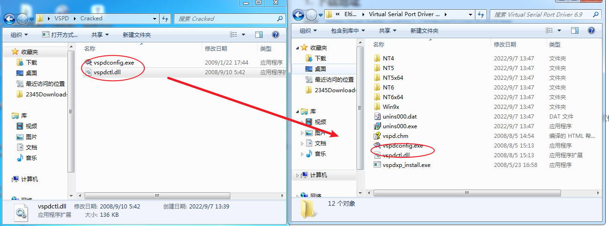
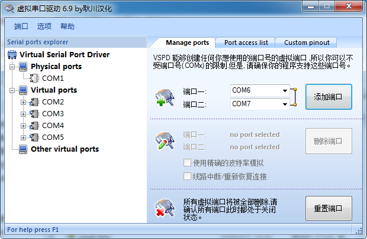

### 1. 下载地址

链接：https://pan.baidu.com/s/1-TYH4q2oiTQ2iyQh2hOOew 
提取码：0fk1

或 `4. 其他\2. 小工具` 下安装包

### 2. 安装

点击 `vspd.exe` 进行安装，过程无需其他设置

### 3. 汉化

打开 `Cracked` 文件夹，将 `vspdconfig.exe` 和 `vspdctl.dll` 复制替换安装路径下的同名文件

### 4. 使用

点击桌面的快捷方式，效果如下：

