### 1. 下载地址

5.12.9版本网盘地址：

链接：https://pan.baidu.com/s/1khzT5xRnPwDypN_TrPsbPA 
提取码：gd6b

官网下载地址：https://download.qt.io/

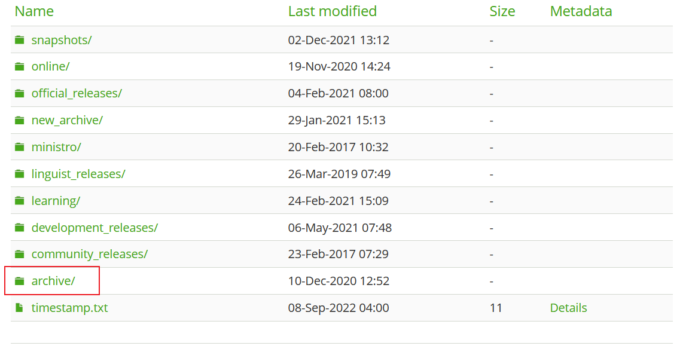

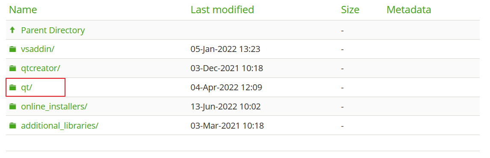

选择合适的软件版本进行下载安装

### 2. 软件安装

1. 打开安装程序，点击Next

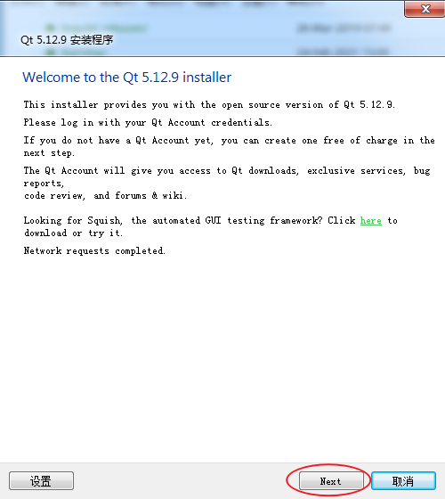

2. 登录验证信息，输入QT账号密码，点击Next

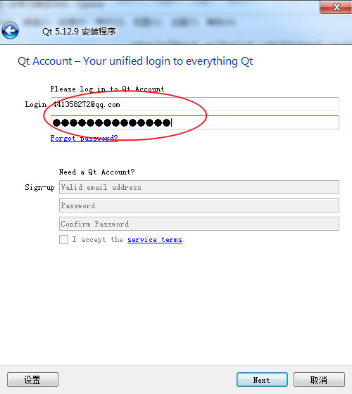

3. 勾选，点击下一步

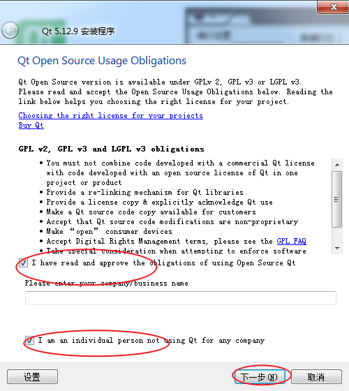

4. 继续下一步

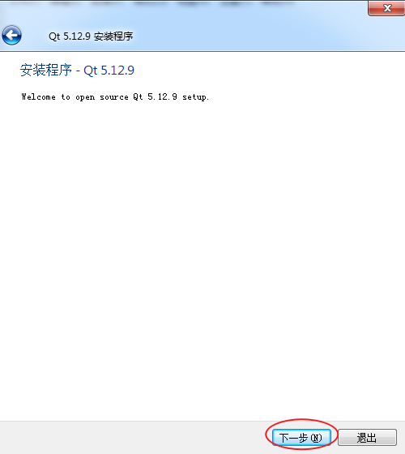

5. 指定QT安装路径，点击下一步

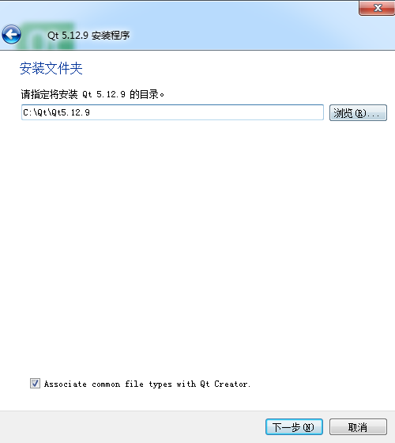

6. 选择组件，选择MinGW进行编译，其他组件暂时不需要，Tool选择默认的CDB即可，然后下一步

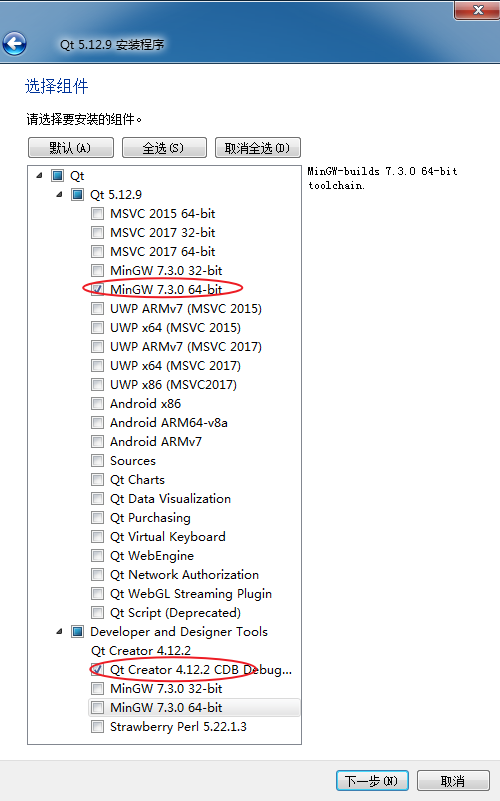

7. 勾选，下一步

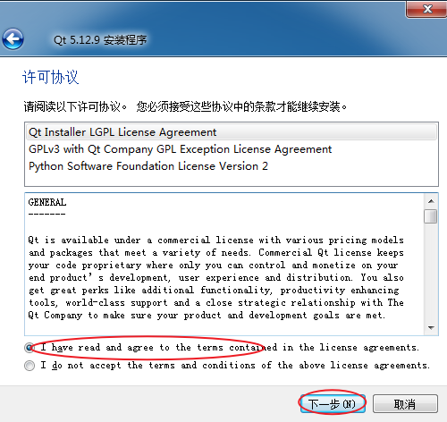

8. 继续下一步

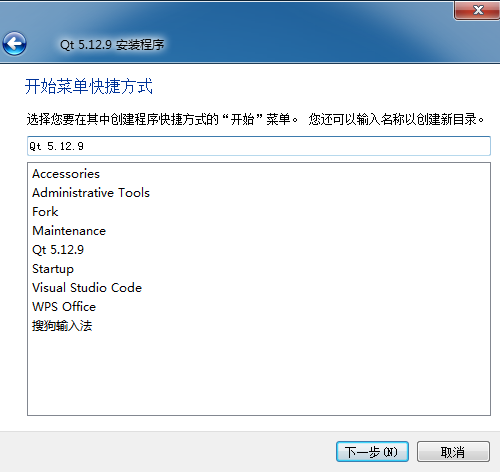

9. 点击安装，进行安装

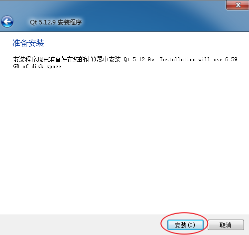

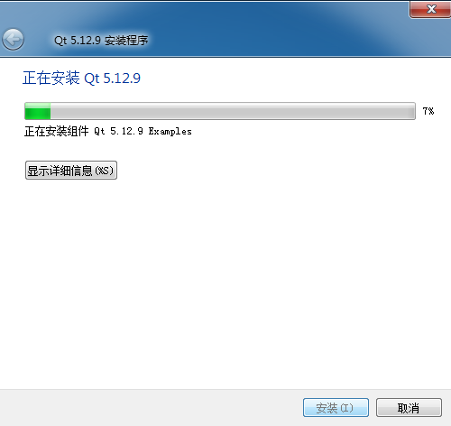

10. 安装完成，开启QT体验之旅

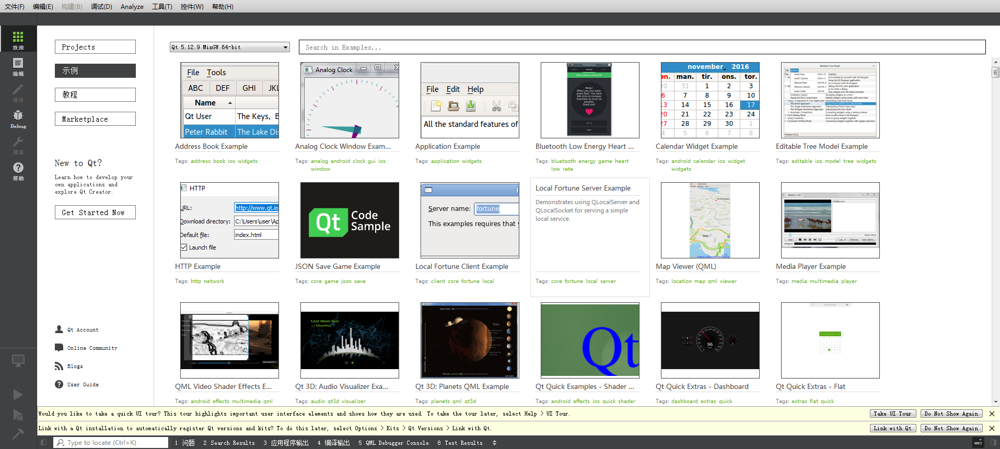