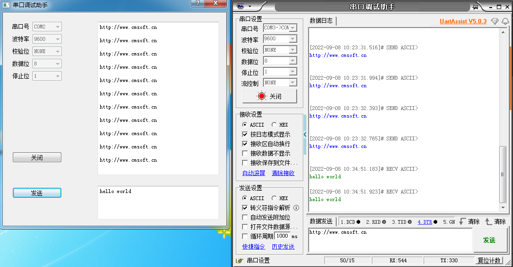
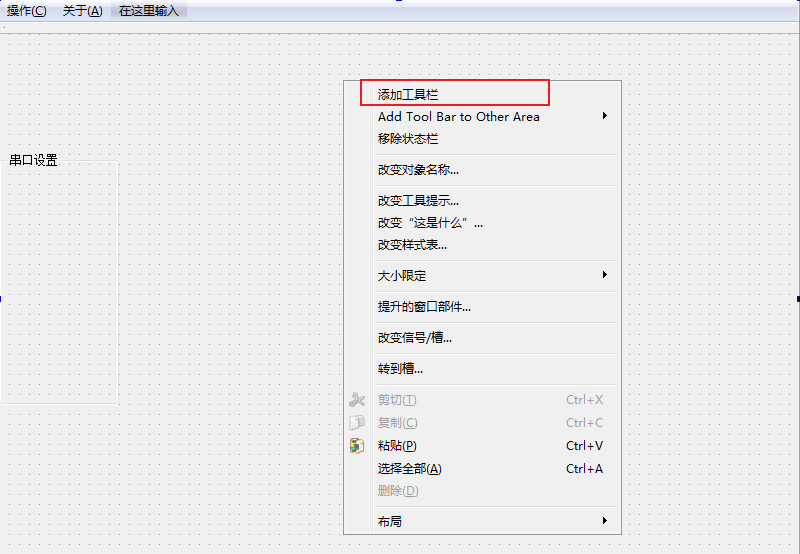

## QT学习笔记

### 一、 软件安装

空

### 二、 软件代码

1. 查找可用串口并显示

    通过创建一个 `Combo Box` ，将可用的串口号显示出来。

    ```c
    foreach (const QSerialPortInfo &info, QSerialPortInfo::availablePorts())
    {
        ui->cBoxerialPort->addItem(info.portName());
    }
    ```

2. 数据位、校验位、停止位的配置

    因数据位、校验位、停止位正常使用中不会改动，为了简单在软件开始屏蔽了这3个属性的设置，默认设置8位数据，无校验位，1位停止位。

    ```c
    //屏蔽数据位、校验位、停止位设置
    ui->cBoxParity->setEnabled(false);
    ui->cBoxDataBits->setEnabled(false);
    ui->cBoxStopBits->setEnabled(false);
    ```

3. 打开/关闭串口按键槽函数

    在打开/关闭串口按键槽函数中有一个判断当前串口是否是打开状态的标志位 `isOpen` 。当串口打开时，按键显示"关闭"，并且设置菜单被禁止；当串口关闭时，按键显示"打开"，设置菜单能够进行串口号选择和波特率选择，点击按键后会判断是否正确打开，如没有打开会弹出提示框（需添加 `#include <QMessageBox>` 才能使用 `QMessageBox` 提示功能）。

    ```c
    void Dialog::on_btnOpen_clicked()
    {
        if (true == isOpen)
        {
            //关闭串口
            mSerialPort.close();
            //打开设置菜单
            ui->cBoxSerialPort->setEnabled(true);
            ui->cBoxBaudRate->setEnabled(true);
            //切换到"打开"
            ui->btnOpen->setText("打开");
            //禁止发送按键
            ui->btnSend->setEnabled(false);
            //切换状态标志
            isOpen = false;
        }
        else
        {
            //获取串口名
            QString portName = ui->cBoxSerialPort->currentText();
            //设置串口名
            mSerialPort.setPortName(ui->cBoxSerialPort->currentText());
            //设置波特率
            mSerialPort.setBaudRate(ui->cBoxBaudRate->currentText().toInt());
            //设置数据位
            mSerialPort.setDataBits(QSerialPort::Data8);
            //设置校验位
            mSerialPort.setParity(QSerialPort::NoParity);
            //设置停止位
            mSerialPort.setStopBits(QSerialPort::OneStop);
            //设置流控制
            mSerialPort.setFlowControl(QSerialPort::NoFlowControl); //设置为无流控制
    
            //打开串口
            mSerialPort.open(QIODevice::ReadWrite);
            if (true == mSerialPort.isOpen())
            {
                //关闭设置菜单
                ui->cBoxSerialPort->setEnabled(false);
                ui->cBoxBaudRate->setEnabled(false);
                //切换到"关闭"
                ui->btnOpen->setText("关闭");
                //使能发送按键
                ui->btnSend->setEnabled(true);
                //切换状态标志
                isOpen = true;
            }
            else
            {
                //未能打开提示
                QMessageBox::critical(this, tr("打开失败"), tr("未能打开串口 ") + portName + tr("\n该串口设备不存在或已被占用"), QMessageBox::Ok);
            }
        }
    }
    ```

4. 发送槽函数

    发送槽函数比较简单，先获取发送区的字符，调用 `write` 函数，但中间会有字符转换的问题，详见 4.1 章节。

    ```c
    void Dialog::on_btnSend_clicked()
    {
        if (true == isOpen)
        {
            mSerialPort.write(ui->tEditSend->toPlainText().toLatin1());
        }
    }
    ```

5. 读取数据

    使用函数连接信号和槽，什么信号？什么槽？

    什么信号？串口接受到数据的信号 `readyRead()`;

    什么槽？接受到信号后需要跳转到的执行函数 `void on_serialPort_readData()`；

    可以用单片机的思想理解就是，监测到串口触发 `readyRead()` ， 便跳转到 `on_serialPort_readData()` 函数；

    怎么连接？

    ```c
    //连接信号和槽
    connect(&mSerialPort, SIGNAL(readyRead()), this, SLOT(on_serialPort_readData()));
    ```

    参数1：需要连接的对象指针：串口；

    参数2：需要连接的信号类型： `readyRead()`;

    参数3：谁的槽来接受：`this`；

    参数4 ：槽函数：`on_serialPort_readData()`;

    读取数据槽函数：读取串口数据，设置数据到接收文本框显示出来；

    ```c
    void Dialog::on_serialPort_readData()
    {
        if (true == isOpen)
        {
            QByteArray recvData = mSerialPort.readAll();
    
            ui->tEditRecv->append(QString(recvData));
        }
    }
    ```

6. 最终实现效果

    

### 三、 学习过程问题记录

* 工具栏

添加工具栏`QToolBar`，鼠标右击"添加工具栏"。



工具栏中添加带图标的按键：无法在工具栏中添加`Push Button`按钮，只能直接拖动`QAction`到工具栏。

`geometry`：设置工具栏大小和位置；

`movable`：禁止/使能工具栏移动；

`toolButtonStyle`：设置按键图标和文字显示样式；

* Frame控件

    形成一个占位，显示设置成一定的样式；
    
* 窗口缩放

    目前UI界面比较简单，不需要支持界面缩放，将界面设置为一个固定的大小。

    先查看主窗口的大小 `geometry` 记录长度和宽度大小；

    将 `minimumSize` 和 `maximumSize`中的长度和宽度设置跟 `geometry` 保持一致，窗口大小便固定下来了。

### 四、Qt语法

1. ​    字符串

    - 字符串操作直接使用 "+" 号，不需要使用 `copystr` ,  `meset` 等操作，如：

        ```c
        ui->lEditText->setText(ui->lEditText->text() + "疑是地上霜");
        ```

    - 字符串转换

        ```c
        mSerialPort.write(ui->tEditSend->toPlainText().toLatin1());
        ```

        `write` 函数原型： `write(const char *data)` ，需传入 `char` 型指针；

        `toPlainText()`  返回的是 `QSting` 型，如果直接作为 `write` 的参数编译器会进行报错，需将 `QSrting` 转换成 `*char` ;

        `toLatin1` 、`toLocal8Bit` 都是 `QString` 转 `QByteArray` 的方法，`Latin1` 代表ASCII，`Local8Bit` 代表unicode。

    - QString()

        `QString()` 可以将一些字符型数据转换成 `QString` 类型；

### 五、 总结

* **优点**

    1. 初版demo，代码简单，容易理解；
    2. 在此基础上进行二次DIY，匹配到相应的场景；

* **缺点**

    1. 功能简单，UI不美观；
    2. 暂不支持HEX解码输出；
    3. 在出现大量数据的时候可能会出现各种BUG。

    总的来说，作为初次使用QT，实现了简单的串口收发和UI设置，是个人的一次突破，后期会针对此Demo进行各种优化，以适配各种测试调试场景。

    

    感谢 `果果小师弟` 公众号的开源例程和B站 `somebot萨姆博特科技` 的视频讲解，附上B站视频连接：

    https://www.bilibili.com/video/BV1dt4y1Q7vq?p=1&vd_source=a9587efc8e368f42032621dff1ca745f