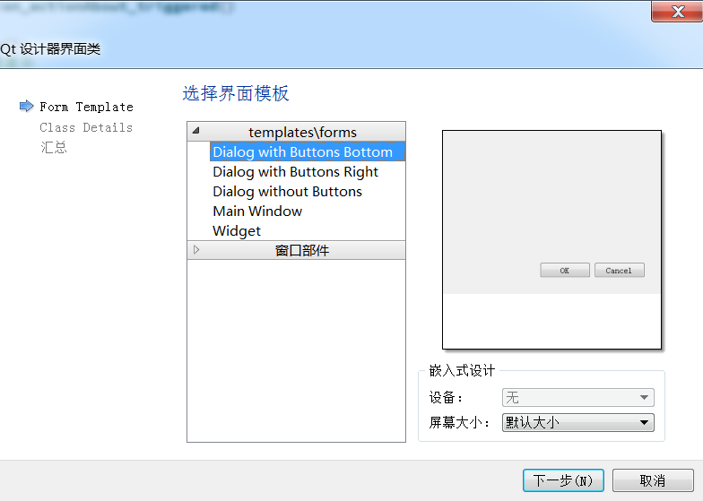

## 软件开发记录

### 前言

​	之前在学习MCU RTOS的过程中一直想学习一款GUI开发软件，可以将自己想要的信息通过可视化界面的方式显示出来，这就非常的炫酷 :+1:，所以当时学习了emWin, ToughGFX, LittleVGL。但是在学习中发现基于嵌入式的GUI开发软件存在一定的弊端，比如软件移植代码量大，没有图形化的设计界面，不容易上手。作为GUI轻度使用用户，去花时间学习这些GUI框架，确实是费时又费力。但现在需要可视化调试的场景越来越多，所以急需一款容易上手，轻度代码编写，具有图形化设计的桌面开发工具。众里寻他千百度，在众多开发平台中选择了QT开发。

​	上个仓库使用QT实现了串口的收发，本着学玩结合的精神，再次基于QT实现一款梦幻西游(我的初恋:heart:)的宝宝环成本计算器。既能够锻炼了QT的开发能力，也能统计平时玩梦幻跑环的成本，两全其美，美滋滋~~~

​	接下来，看我表演。

### UI界面设计

- 在 `PushButton` 中添加图标 `icon` 时发现，在页面布局的时候图标能够显示出来，但是运行之后图标就没有了，如图：

    

    

    作为有界面洁癖的同学，这种情况怎么能忍，在度娘的帮助下，顺利解决问题。

    添加 `icon` 时不能够使用 `选择文件` ，而是使用 `选择资源`，但是在点击 `选择资源` 发现时空的，沃日~~~

    

    继续找度娘，原来需要对项目进行外部资源添加，具体实现步骤如下：

    1. 新建一个 `Qt Resource File ` ,命名并添加到工程之中；

        

    	

    2. 前缀命A名为 `image` ，点击 `Add Prefix` ，用来保存文件；

    	

    3. 点击 `Add Files` 选择相应的图片，完成图片添加；

    	

    4. 在点开 `选择资源` 后，图标就出现了，NICE~~~

    	

- 如何在空白区域添加图片

    - 安装上述方式将图片添加到资源库；

    - 添加个 `Label` 标签，删除文字，在 `pixmap` 中选择图片，调整好大小；

        

- 添加第二(设置)菜单界面

    1. 添加一个 `Dialog` 界面；

        

        

        

    2. 在主界面头文件中申明 `#include "settingdialog.h"` 并定义 添加定义 `SettingDialog settingDialog;`;

        

    3. 在按键槽函数中开启第二菜单界面；

        ```c
        void Dialog::on_pushButtonSetting_clicked()
        {
            settingDialog.show();
        }
        ```

        


