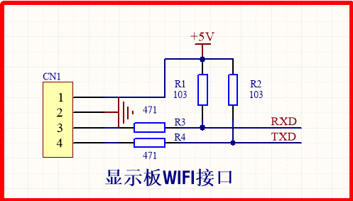

### 1. 触摸扫描函数影响系统时间片

>现象描述：系统计时不准确，1s时间片经测试为1.1s  
>MCU:SC82F74A2/12MHZ，10路TK

#### 1.1 原因分析

1. 逐一屏蔽函数，发现在10ms时间片中调用KeyScan()会导致10ms时间片不准确；
2. 测试KeyScan()执行时间为3.9ms+，按键数量越多，KeyScan()扫描时间越长；
3. 系统最小时间片2ms，按键扫描时间(3.9ms) > 2ms，从而影响了系统时间片；

```c
/* 系统主框架 */
void main(void)
{
    ...
    ...

    while (1)
	{
        ...

		TimeProc();

		KeyCtrl();

        ...
	}
}
```

```c
/* 时间片函数 */
void TimeProc(void)
{
	static unsigned char uc10msCnt = 0;
	static unsigned char uc100msCnt = 0;
	static unsigned char uc1sCnt = 0;
	static unsigned char uc1minCnt = 0;

	timeFlag &= TIME_BASE;
	if (timeFlag)
	{
		timeFlag = 0;
		timeFlag |= TIME_2MS;

		uc10msCnt++;
		if (uc10msCnt >= 5)
		{
			timeFlag |= TIME_10MS;
			uc10msCnt = 0;

			uc100msCnt++;
			if (uc100msCnt >= 10)
			{
				timeFlag |= TIME_100MS;
				uc100msCnt = 0;

				uc1sCnt++;
				if (uc1sCnt >= 10)
				{
					timeFlag |= TIME_1S;
					uc1sCnt = 0;

					uc1minCnt++;
					if (uc1minCnt >= 60)
					{
						timeFlag |= TIME_1MIN;
						uc1minCnt = 0;
					}
				}
			}
		}
	}
}
```

KeyCtrl()运行时间太长，导致TimeProc()没有及时运行，2ms最小的时间片产生误差；

#### 1.2 对策

系统最小时间片更改为5ms

#### 1.3 总结

系统函数最长的执行时间不能大于系统最小时间片。

---

### 2. 外部中断

> 现象描述：显示板(从机)和按键板(主机)采用模拟串口通讯，待机状态下通讯正常，但是开机后发现模拟串口出现异常，显示板经常不回复按键板消息。

#### 2.1 原因分析

* PG电机反馈是采用外部中断进行检测；
* 开机后，PG电机开始工作，会触发外部中断;
* 屏蔽PG电机外部中断，发现通讯回复正常。

#### 2.2 对策

PG电机反馈由外部中断改为使用IO扫描。

#### 2.3 总结

* 对实时性要求不高的产品，如过零检测，电机信号反馈使用IO扫描进行检测；
* 赛元外部中断容易出问题。

---

### 3. 蜂鸣器美音

> 现象描述：客户反馈烟机电源板美音存在异响尾音。

#### 3.1 电路原理


#### 3.2 原因分析

* 蜂鸣器美音电路有两个IO口控制，一个PWM口，一个控制蜂鸣器开关；
* 替换控制电路中的Q1(8550)，故障消失。在蜂鸣器关闭期间，8550没有彻底关断蜂鸣器，导致异常尾音情况。

#### 3.3对策

8550替换成耐压值更高的9550。

---

### 4. 体感距离不够

> 现象描述：客户反馈体感距离不够，实测样板体感距离在5cm左右，未达到客户要求(10-15cm)。

#### 4.1 电路原理图


#### 4.2 原因分析

1. 将发射管限流电阻由1K改为470R，并无明显改善效果；
2. 用热缩管代替壳体完全盖住发射管和接收头，体感距离能够满足客户要求；
3. 开观察窗发现壳体并未完全覆盖住发射管和接收头；
4. 手动改装壳体确保壳体完全覆盖发射管，体感距离能够满足客户要求；
5. 用热缩管代替壳体完全仅盖住发射管，漏出接收头，体感距离能够满足客户要求，但触发不是很稳定；

#### 4.3 总结

壳体完全包裹发射管对增加体感距离有改善。

#### 4.4 对策

修改结构件，保证壳体能够完全包裹发射管。

---

### 5. sprintf格式化输出函数

1. 使用sprintf需要添加头文件`#include <stdio.h>`;

2. 如下是keil中的例程：

   ```c
   #include <stdio.h>
   
   void tst_sprintf (void) {
     char buf [100];
     int n;
     int a,b;
     float pi;
   
     a = 123;
     b = 456;
     pi = 3.14159;
   
     n = sprintf (buf, "%f\n", 1.1);
     n += sprintf (buf+n, "%d\n", a);
     n += sprintf (buf+n, "%d %s %g", b, "---", pi);
   
     puts (buf);
   }
   ```

   事例中，输出`int`型数据时使用格式`%d`，但是如果是`unsigned char`型时使用`%d`进行输出时就会出现数据错误。

3. 引用keil中的对`sprinf`中的描述：
	> The **sprintf**  function formats a series of strings and numeric values and stores the resulting  string in *buffer*. This function is similar to the **printf**  routine, but it stores the formatted output in *buffer* rather  than sending it to the output stream.

	* 输出格式跟`printf`保持一致：

	* `unsigned char`使用`%bu`，输出8位无符号十进制整数；

	* `char`使用`%bd`，输出8位有符号十进制整数；

	* 其他输出格式参考keil中关于`printf`的说明。

---

### 6. 小米模块bug说明

> 现象描述：发送重置命令`restore`后，小米模组不会回复命令。如果不发送重置命令，小米模组能够正常回复命令。

#### 6.1 故障现象复现

1. 输入wifi密码时错误，导致小米模组网络net处在`offline`即连接中状态；
2. 因为一直连接不上，断电再上电，小米模组仍处在`offline`即连接中状态；
3. 此时如果发送`restore`后，小米模组就会出现假死现象，不回复命令。

#### 6.2 现象解决

关掉wifi，重新上电后，小米模块就会回复到`uap`即等待连接状态，重新连接即可。

---

### 7. 涂鸦WIFI状态

* `0x00`    Smartcongif配网模式

* `0x01`    AP配网模式

* `0x02`    WIFI已配置但未连上路由器(如果wifi模块连接路由器后，路由器断电，wifi状态会更改为`0x02`)

* `0x03`    WIFI已配置且连上路由器(如果wifi模块连接路由器后，路由器断网，wifi状态会更改为`0x03`)

* `0x04`    已连上路由器且连接到云端

* `0x05`    WIFI设备处于低功耗模式

---

### 8. 过零检测电路

#### 8.1 电路原理图


#### 8.2 电路参数

| R32-R35 | R45 | R41 | 过零信号时间 |
|  ----  | ----  |  ----  | ----  |
| 51K  | 220R | 10K | 790us |
| 68K  | 220R | 10K | 1000us |
| 51K  | 4.7K | 1K | 2400us |

#### 8.3 总结

过零信号时间应保持在1ms以上

---

### 9. 指针问题

> 编译提示错误`WARNING L13: RECURSIVE CALL TO SEGMENT

伪代码

```c
xdata unsigned char dispBuf[3] = {0};

void Func(void)
{
	unsigned char *buf;

	buf = dispBuf[2];

	...
}
```

关于C51中指针定义的使用
指针 `p` 是指向 `data` 区,则应定义为： `char data *p` 。还可指定指针本身的存放内存类型,如：`char data * xdata p` ，其含义是指针 `p` 指向 `data` 区变量,而其本身存放在 `xdata` 区。

上面报错的原因大概是因为数组定义在 `xdata` 区，但是指针定义为指向 `data` 区的指针。改进如下：

```c
xdata unsigned char dispBuf[3] = {0};

void Func(void)
{
	unsigned char xdata *buf; //指向xdata区，而本身存放在data区

	buf = dispBuf[2];

	...
}
```

发现仍提示 `WARNING L13` 错误，将 `*buf` 指针申明为静态的或者全局的均可解决问题，如下：

```c
xdata unsigned char dispBuf[3] = {0};

void Func(void)
{
	static unsigned char xdata *buf;

	buf = dispBuf[2];

	...
}
```

```c
xdata unsigned char dispBuf[3] = {0};
unsigned char xdata *buf;

void Func(void)
{
	buf = dispBuf[2];

	...
}
```

---

### 10. Wifi串口电路

> 故障描述：WIFI连接有时候会丢失数据

#### 10.1 原因分析

显示板TXD\RXD上串接了一个470R电阻，而WIFI模块的电平转换电路上面的上拉电阻只有2K；




当显示板TXD为低电平时，可以计算出WIFI模块RXD电压：

上拉电阻：$R = (R9*R10)/(R9+R10) = 1667 $

下拉电阻：$R = 470$

电压：$V=5/(1667+470)*470=1.1$

通常电压大于0.7VDD认为是高电平，小于0.2VDD认为是低电平1.1V大于0.2VDD，WIFI模块可能会认为是高电平，导致数据传输错误。


#### 10.2 对策

将TXD\RXD上470R电阻调低至51R

#### 10.3 总结

很多串口出现数据丢帧的问题都是接口电路不匹配造成信号电压无法拉低或者拉高所导致，所以串口工作时的电压范围也是一项底层需摸底的数据

---

### 11. 按键显示复用电路

电路原理图如下：


注意如下几点：

1. 进行按键扫描时，COM设置为高阻态，而不是设置为输出高；（考虑到LED灯的反向耐压，防止LED被烧毁）

2. SEG口由输出设置为上拉输入前，现将SEG设置为输出高。（LED存在结电容，先设置为输出高并等待些许NOP可以将LED结电容充电。防止直接由输出设置为输出后，即使没有触发按键但是读到的仍然是低电平）

---

### 12. 代码长度超过ROM空间

> keil编译时提示"代码长度超过ROM空间"
> code = 16710 > 芯片16K flash

#### 12.1 对策

将定义在xdata区的常用变量更改为data区，因为data区使用直接寻址方式，xdata去使用间接寻址方式，优化有可解决代码长度过长的问题。

修改前:


修改后：


---